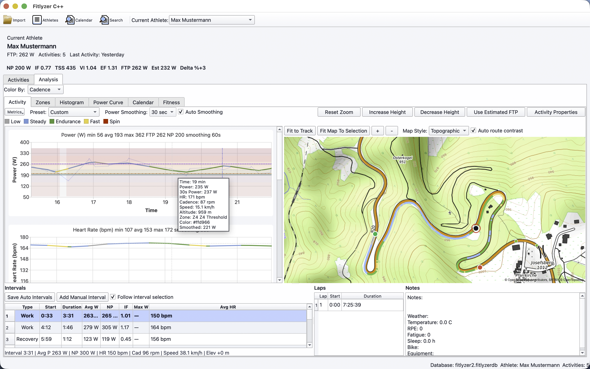

# FitlyzerC

<p align="center">

</p>

<p align="center">
<b>Modern Garmin FIT analysis for cyclists, runners, triathletes, coaches, and data enthusiasts.</b>
</p>

---

> [!WARNING]
> **FitlyzerC is pre-release software.**
>
> Database schemas, internal data structures, and project formats may change between releases. Upgrading may require recreating databases or re-importing activities. Backward compatibility is not guaranteed yet.

## Download

Prebuilt binaries are available from the [Releases](../../releases) page.

| Platform | Package |
|----------|---------|
| Windows | NSIS Installer |
| macOS | DMG |
| Linux | AppImage |

---

## What is FitlyzerC?

FitlyzerC is a native desktop application for analyzing Garmin FIT activity files.

Unlike cloud-based training platforms, FitlyzerC focuses on local-first analysis, high-performance visualization, and complete ownership of your training data. The application is written in modern C++23 and Qt 6 and runs on Windows, macOS, and Linux.

The project is designed primarily for cycling and currently focuses on detailed ride analysis, interval inspection, power-based training metrics, GPS visualization, and athlete management.

---

## Features

### Activity Analysis

- Import Garmin FIT activities
- Decode FIT files using the Garmin FIT SDK
- Power, heart rate, cadence, speed, elevation and GPS analysis
- Automatic interval detection
- Power curve generation
- Power histograms
- Training load calculations
- Fitness tracking metrics
- Workout review tools
- Ride notes

### Interactive Charts

- Zoomable and pannable charts
- Synchronized chart navigation
- Power analysis
- Fitness trend visualization
- Ride timeline inspection
- Smoothed data visualization

### Mapping

- Interactive route display
- Multiple map styles
- GPS track visualization
- Segment selection directly on the map
- Draggable selection markers
- Route coloring by:
  - Power
  - Heart Rate
  - Cadence
  - Speed
  - Altitude
  - Gradient

### Athlete Management

- Multiple athlete profiles
- Athlete-specific FTP settings
- Training history
- Calendar-based activity browsing
- Planned workouts

### Video Export

- Animated ride playback
- Map-based activity visualization
- Chart synchronization
- Power zone overlays
- MP4 export through FFmpeg
- Custom export settings

### Cross Platform

- Windows
- macOS
- Linux

---

## Screenshots

<p align="center">

</p>

---

## Current Development Status

FitlyzerC is under active development.

Recent milestones include:

- Linux AppImage packaging
- Reworked map tile system
- Additional map styles
- Improved route rendering
- Movable interval markers
- Segment selection on maps
- Video export support
- FFmpeg integration
- Multiple video rendering improvements

### Planned Areas

- Additional training metrics
- Reporting features
- More export formats
- Better workout planning
- UI/UX refinements
- Performance improvements

---

## Technology Stack

| Component | Technology |
|------------|------------|
| Language | C++23 |
| GUI | Qt 6 |
| Charts | Qt Charts |
| Database | SQLite |
| Networking | Qt Network |
| Build System | CMake |
| Packaging | CPack |
| FIT Parsing | Garmin FIT SDK |

---

## Project Structure

```text
src/
├── analysis/      Training metrics, power curves, interval detection
├── charts/        Interactive chart widgets
├── core/          Zone calculations and shared logic
├── database/      SQLite repositories and schema management
├── fit/           Garmin FIT decoding
├── gui/           User interface
├── maps/          Tile engine and route rendering
├── model/         Serialization helpers
├── platform/      OS-specific functionality
├── video/         Video export pipeline
└── reports/       Reporting infrastructure
```

---

## Build Requirements

### Required Software

| Component | Version |
|------------|----------|
| CMake | 3.21+ |
| Qt | 6.x |
| Compiler | C++23 capable |
| Git | Current |
| Ninja | Recommended |
| FFmpeg (for bundled releases) | Source tree in `third_party/ffmpeg` or prebuilt binary in `resources/ffmpeg/<platform>/` |

---

# Building

## macOS

### Dependencies

```bash
brew install cmake ninja qt
```

```bash
export PATH="/opt/homebrew/opt/qt/bin:$PATH"
```

### Configure

```bash
cmake --preset macos-release
```

### Build

```bash
cmake --build --preset macos-release
```

### Create DMG

```bash
cmake --build --preset macos-dmg
```

---

## Windows

Install:

- Visual Studio 2026
- Qt 6 (MSVC)
- CMake
- Ninja

### Configure

```cmd
cmake --preset windows-release
```

### Build

```cmd
cmake --build --preset windows-release
```

### Create Installer

```cmd
cmake --build --preset windows-nsis
```

---

## Linux

### Arch Linux

```bash
sudo pacman -S \
    base-devel \
    cmake \
    ninja \
    qt6-base \
    qt6-charts \
    git
```

### Configure

```bash
cmake --preset linux-release
```

### Build

```bash
cmake --build --preset linux-release
```

### AppImage

Install:

```bash
sudo pacman -S patchelf
yay -S appimagetool-bin
```

```bash
cmake --preset linux-appimage
cmake --build --preset linux-appimage
```

---

## One-Command Packaging

```bash
cmake -P scripts/package.cmake
```

Supported outputs:

| Platform | Output |
|----------|---------|
| Windows | Setup.exe |
| macOS | DMG |
| Linux | AppImage |

---

## Garmin FIT SDK

By default, CMake automatically downloads the Garmin FIT SDK.

Repository:

https://github.com/garmin/fit-cpp-sdk

To use a local SDK copy:

```bash
cmake \
  -DGARMIN_FIT_SDK_DIR=/path/to/sdk \
  -S . \
  -B build
```

Supported locations:

```text
fit-sdk/
fit-sdk/src/
fit-sdk/cpp-sdk/src/
```

---

## FFmpeg Bundling

Release builds are configured to bundle FFmpeg with the app so end users do not need a system FFmpeg installation.

Bundling priority:

1. Build from FFmpeg source in `third_party/ffmpeg`
2. Auto-download FFmpeg from `https://git.ffmpeg.org/ffmpeg.git` when the local source tree is missing
3. Use prebuilt executable in `resources/ffmpeg/<platform>/`
4. Fallback to system `ffmpeg` if neither source nor bundled binary is available

Default prebuilt lookup paths:

```text
resources/ffmpeg/macos/ffmpeg
resources/ffmpeg/linux/ffmpeg
resources/ffmpeg/windows/ffmpeg.exe
```

Useful CMake options:

```bash
-DFITLYZERC_BUNDLE_FFMPEG=ON
-DFITLYZERC_FFMPEG_SOURCE_DIR=third_party/ffmpeg
-DFITLYZERC_AUTO_DOWNLOAD_FFMPEG=ON
-DFITLYZERC_FFMPEG_GIT_REPOSITORY=https://git.ffmpeg.org/ffmpeg.git
-DFITLYZERC_FFMPEG_GIT_TAG=n7.0
-DFITLYZERC_FFMPEG_BINARY_PATH=/absolute/path/to/ffmpeg
```

If you want fully reproducible builds, point `FITLYZERC_FFMPEG_SOURCE_DIR` at a local FFmpeg checkout or pin `FITLYZERC_FFMPEG_GIT_TAG` to a specific release tag/commit.

Disable bundling (not recommended for release artifacts):

```bash
cmake -DFITLYZERC_BUNDLE_FFMPEG=OFF --preset <your-preset>
```

---

## Running

Typical workflow:

1. Create an athlete
2. Import FIT activities
3. Browse activities in the calendar
4. Inspect charts and maps
5. Select intervals
6. Analyze performance metrics
7. Export video visualizations

---

## Contributing

Issues, bug reports, feature requests and pull requests are welcome.

If you encounter a problem, include:

- Operating system
- Application version
- FIT file characteristics
- Steps to reproduce

---

## License

Informal license:

> Do whatever you want with it, provide attribution and link back to the repository.
>
> Except dopers. They cannot use it.
